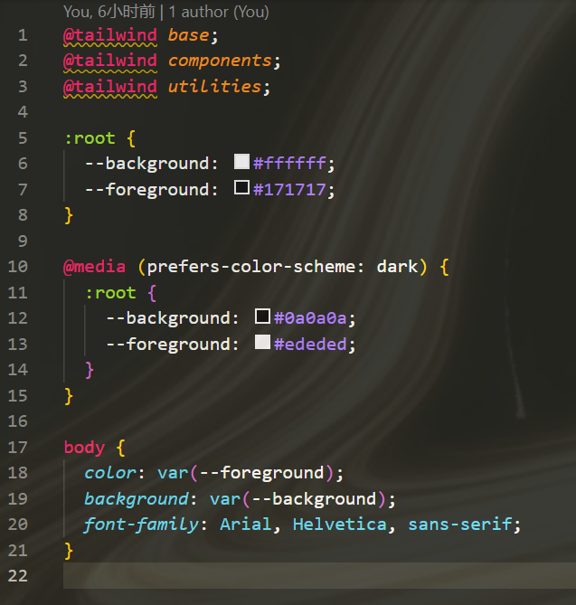

## 响应式布局 
    媒体查询
    flex

## 主题

媒体查询系统配置来设置深色浅色模式

思考？
是识别系统的模式来自动改变主题？（媒体查询实现）
还是支持页面手动修改主题（nextui 支持）

方案：支持跟随系统 + 手动控制深浅色模式

``` javaScript
    window.matchMedia('(prefers-color-scheme: dark)').matches  //获取媒体查询
    //next服务端渲染无法获取window
```