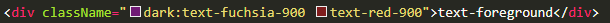

## 响应式布局 
    媒体查询
    flex

## 主题


媒体查询系统配置来设置深色浅色模式

思考？
是识别系统的模式来自动改变主题？（手写媒体查询实现）
还是支持页面手动修改主题（nextui 支持）

方案：支持跟随系统 + 手动控制深浅色模式
``` javaScript
    window.matchMedia('(prefers-color-scheme: dark)').matches  //获取媒体查询
    // next服务端渲染无法获取window
    // 增加layout.tsx的user client
    // 使用js监测系统主题变化，利用nextui的class drak和light切换
    // 后续增加手动更改theme
```

后续：后续写代码如何考虑主题区别，编码方式？


这种方式如何支持自定义主题？


